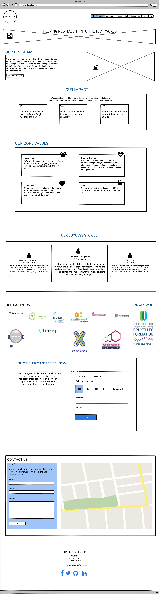

# Development Strategy

This is a web site recreated from the home page [Hack Your Future](https://hackyourfuture.be/program), this web is recreated by the Group 4 of [HackYourFutureBelgium](https://hackyourfuture.be/) class-13-14 from the second module called [Incremental Development](https://github.com/HackYourFutureBelgium/incremental-development)

## Group 4 members

- [Rafael](https://github.com/rago89)
- [Inggrit E Novaleta](https://gist.github.com/inggritenovaleta)
- [Zenat Ikbal](https://github.com/ZM102)
- [Saban Yelkenci](https://github.com/sabanyelkenci)
- [Mahmoud Hasan](https://github.com/MahmoudHasan83)
- [Ali Abouteir](https://github.com/AliAbouteir)

## Coach

- [Tamer](https://github.com/talmurshidi)
- [Stéphane Nicoll](https://github.com/snicoll)

## Setting up Repository

> Assigned to **Inggrit E Novaleta**

1. Created a new repository
1. Add collaborators
1. Add a license
1. Create a README
1. turn on GitHub Pages

## Backlog

> Assigned to **Inggrit E Novaleta**.

## Development strategy creation

> Assigned to **Saban Yelkenci**

1. Write a development strategy
1. Translate the strategy into issues

---

### 

> Assigned to **Saban Yelkenci**

### Create Readme in GitHub

> Assigned to **Inggrit E Novaleta**..

- Create a [README.md](https://github.com/inggritenovaleta/hackyourfuture-g4/blob/main/planning/README.md) file
- Create a project description
- Team members
- Table of contents with: General info, Technologies, Screenshots, Status, contribution and launch

## I. Header With Menu

> Assigned to **.......**

> Small step.

**As a User, I want to go to other pages (The Program, Volunteer, About, FAQ, Support Us, and Registration ), so I can see what the website has to offer.**

- [ ] _Given any browser when a user navigates to our URL then the site should appear with no errors showing the other pages of the website._

### REPO

- This user story is developed on branch `header`.
- This branch is merged to `main` branch after the acceptance criteria have been checked off.

### Concern A

- `index.html`: file created to build the main page.

### Concern B

- `style.css`: to style all the page

### milestone is `header`

### HTML (_label_)

- Header of the web page (_issue_)
  - [ ] uses a "navbar container flex" classes
  - [ ] is the header created with container element

### CSS (_label_)

- the "navbar container flex" class (_issue_)

## II. Banner Section

> Assigned to **......**.

> Medium step.

**As a user, I want to see a slogan that a short and striking or memorable phrase with a picture. So that it will be clear the mission of the web page**

- [ ] Given the user's want to see the slogan that define mission of the HYFB, there must be a showcase on the main page displaying thats is "HELPING NEW TALENT INTO THE TECH WORLD"

### REPO

- This user story is developed on branch `showcase`.
- This branch is merged to `main` branch after the acceptance criteria have been checked off.

### Concern A

- `index.html`: file created to build the main page.

### Concern B

- `style.css`: to style all the page

### milestone is `Banner`

### HTML (_label_)

- Banner showcase html of the web page (_issue_)
  - [ ] Creates `div` element
  - [ ] Uses a `background image` and `h1` title

### CSS (_label_)

- the banner class (_issue_) _more could appear_

## III. Our Program

> Assigned to **......**.

> Medium step.

**As a user I want to see the brief information about the website so that I will know what kind of website it is.**

- [ ] \_Given the user's want to have a brief information of the website, there must be a showcase on the main page displaying the information with a 'Discover More' button for the full description.

### REPO

- This user story is developed on branch `our-program`.
- This branch is merged to `main` branch after the acceptance criteria have been checked off.

### Concern A

- `index.html`: file created to build the main page.

### Concern B

- `style.css`: to style all the page

### milestone is `Our Program`

### HTML (_label_)

- Our Program section html of the web page (_issue_)
  - [ ] Creates `div` elements for the paragraph and image
  - [ ] Uses `h2`, `p` and `a` elements

### CSS (_label_)

- the `our-program `class (_issue_) _more could appear_

## IV. Our Impact

> Assigned to **......**.

> Medium step.

**As a user I want to see the statistic the website so that I will know what the organization has achieved.**

- [ ] _Given the user's want to see the statistic of the organization, there must be a showcase on the main page displaying the statistic of the program, includes the graduates, the employment rate, and how many students HYF have._

### REPO

- This user story is developed on branch `our-impact`.
- This branch is merged to `main` branch after the acceptance criteria have been checked off.

### Concern A

- `index.html`: file created to build the main page.

### Concern B

- `style.css`: to style all the page

### milestone is `Our Impact`

### HTML (_label_)

- Our Impact Section html of the web page (_issue_)
  - [ ] creates `div` elements
  - [ ] uses `h2` elements for the title and `p` elements for the paragraph
  - [ ] use `h1` elements for the statistical data

### CSS (_label_)

- the `our-impact` class (_issue_) _more could appear_

## V. Our Core Values

> Assigned to **......**.

> Medium step.

**As a user I want to see the core values of the website so that I will be able to see what are the values Hack Your Future employ to fullfil the mission.**

- [ ] _Given the user's want to see the core values of the organization, there must be a showcase on the main page displaying the core values of Hack Your Future with a brief explaination for each value._

### REPO

- This user story is developed on branch `our-core-values`.
- This branch is merged to `main` branch after the acceptance criteria have been checked off.

### Concern A

- `index.html`: file created to build the main page.

### Concern B

- `style.css`: to style all the page

### milestone is `Our Core Values`

### HTML (_label_)

- Our Core Values Section of the web page (_issue_)
  - [ ] Creates `div` elements
  - [ ] use `h3` `img` and `p` elements

### CSS (_label_)

- the `core-values` class (_issue_) _more could appear_

## VI. Our Success Stories

> Assigned to **......**.

> Medium step.

**As a user I want to see the success stories of alumni so that I will know the potential growth of this program.**

- [ ] _Given the user's want to see the success stories of the participants, there must be a showcase on the main page displaying the testimonial and the stories of alumnis and students._

### REPO

- This user story is developed on branch `our-success-stories`.
- This branch is merged to `main` branch after the acceptance criteria have been checked off.

### Concern A

- `index.html`: file created to build the main page.

### Concern B

- `style.css`: to style all the page

### milestone is `Our Success Stories`

### HTML (_label_)

- Our Success Stories Section html of the web page (_issue_)
  - [ ] Creates `div` elements
  - [ ] Uses `h2` element for the title and `h4` elements for the names and uses `p` elements for the paragraph

### CSS (_label_)

- the `Success-Stories` class (_issue_) _more could appear_

## VII. Our Partners

> Assigned to **......**.

> Medium step.

**As a user I want to see the partners of the organization so that I will know wo are the partners that help the organization to fulltif the mission.**

- [ ] _Given the user's want to see the partners, there must be a showcase on the main page displaying the partners by using their logos._

### REPO

- This user story is developed on branch `our-partners`.
- This branch is merged to `main` branch after the acceptance criteria have been checked off.

### Concern A

- `index.html`: file created to build the main page.

### Concern B

- `style.css`: to style all the page

### milestone is `Our Partners`

### HTML (_label_)

- Our Partners Section html of the web page (_issue_)
  - [ ] creates `div` and `img` elements
  - [ ] uses `h2` elements for the title and uses `a` elements for the link of the become a partner

### CSS (_label_)

- the `Our-Partners` class (_issue_) _more could appear_

## VIII. Support

> Assigned to **......**.

> Medium step.

**As a user I want to support the organization through donation so that the organization can fulltil their mission.**

- [ ] _Given the user's want to ssupport the organization, there must be a showcase on the main page displaying the donation form with 'Donate' button as CTA._

### REPO

- This user story is developed on branch `support`.
- This branch is merged to `main` branch after the acceptance criteria have been checked off.

### Concern A

- `index.html`: file created to build the main page.

### Concern B

- `style.css`: to style all the page

### milestone is `Support`

### HTML (_label_)

- Support Section html of the web page (_issue_)
  - [ ] creates `div` elements for the paragraph and donation form
  - [ ] creates `form` element for donation part
  - [ ] uses h1 elements for the title and uses `p` and `button` elements  

### CSS (_label_)

- the "`support` class (_issue_) _more could appear_

## IX. Contact

> Assigned to **......**.

> Medium step.

**As a user I want to see the contact details so that I can ask if have more question and so that I know where is the organization located.**

- [ ] _Given the user's want to see the contact details, there must be a showcase on the main page displaying the contact form with 'Send' button as CTA, along with Google Maps to the location of HYFB._

### REPO

- This user story is developed on branch `contact`.
- This branch is merged to `main` branch after the acceptance criteria have been checked off.

### Concern A

- `index.html`: file created to build the main page.

### Concern B

- `style.css`: to style all the page

### milestone is `Contact`

### HTML (_label_)

- Contact Section html of the web page (_issue_)
  - [ ] Creates div elements for paragraph and map
  - [ ] Creates form elements for the contact
  - [ ] Uses `h1` elements for the title and use `p` elements for the paragraph
  - [ ] Uses `input`, `label`, `text-area `and `button` elements for the contact form

### CSS (_label_)

- the `Contact` class (_issue_) _more could appear_

## X. Footer

> Assigned **.......**

> Small step.

**As a user I want to see the information detail of the organization including the social media pages so that I can check the other platform to know more**

- [ ] \_Given the user's want to see the information details of the organization, there must be a showcase on the main page displaying the address, email, and other social media link (Facebook, Twitter, Github, LinkedIn).

### REPO

- This user story is developed on branch `footer`.
- This branch is merged to `main` branch after the acceptance criteria have been checked off.

### Concern A

- `index.html`: file created to build the main page.

### Concern B

- `style.css`: to style all the page

### milestone is `Footer`

### HTML (_label_)

- Footer Section html of the web page (_issue_)
  - [ ] creates `div` elements,
  - [ ] uses `h3` elements for the title and `p` elements for the text and `a` elements for the email link connection
  - [ ] is the footer of main, the program and the other pages

### CSS (_label_)

- the `Footer` class (_issue_) _more could appear_
